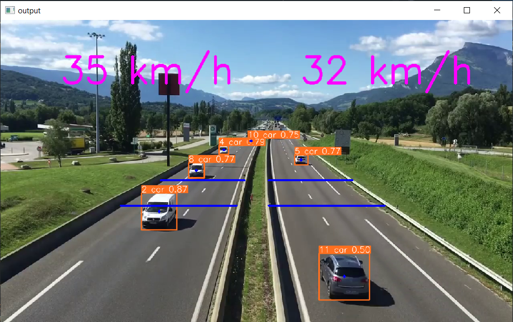

# Speed estimation with Yolov5 + StrongSORT


<div align="center">
<p>
 
</p>
<br>
</div>


## Introduction

This repository contains a highly configurable two-stage-tracker that adjusts to different deployment scenarios. The detections generated by [YOLOv5](https://github.com/ultralytics/yolov5), a family of object detection architectures and models pretrained on the COCO dataset, are passed to the tracker of your choice. Supported ones at the moment are: [StrongSORT](https://github.com/dyhBUPT/StrongSORT)[](https://arxiv.org/pdf/2202.13514.pdf) [OSNet](https://github.com/KaiyangZhou/deep-person-reid)[](https://arxiv.org/abs/1905.00953) and [OCSORT](https://arxiv.org/abs/2203.14360). They can track any object that your Yolov5 model was trained to detect.

## Before you run the tracker

1. Clone the repository recursively:

`git clone --recurse-submodules https://github.com/cakiryusuff/Car-Speed-Estimation.git`

If you already cloned and forgot to use `--recurse-submodules` you can run `git submodule update --init`

2. Make sure that you fulfill all the requirements: Python 3.8 or later with all [requirements.txt](https://github.com/mikel-brostrom/Yolov5_DeepSort_Pytorch/blob/master/requirements.txt) dependencies installed, including torch>=1.7. To install, run:

`pip install -r requirements.txt`

## Filter tracked classes

By default the tracker tracks all MS COCO classes.

If you only want to track persons I recommend you to get [these weights](https://drive.google.com/file/d/1gglIwqxaH2iTvy6lZlXuAcMpd_U0GCUb/view?usp=sharing) for increased performance

```bash
python track.py --source 0 --yolo-weights yolov5/weights/crowdhuman_yolov5m.pt --classes 0  # tracks persons, only
```

If you want to track a subset of the MS COCO classes, add their corresponding index after the classes flag

```bash
python track.py --source 0 --yolo-weights yolov5s.pt --classes 16 17  # tracks cats and dogs, only
```

[Here](https://tech.amikelive.com/node-718/what-object-categories-labels-are-in-coco-dataset/) is a list of all the possible objects that a Yolov5 model trained on MS COCO can detect. Notice that the indexing for the classes in this repo starts at zero.


## MOT compliant results

Can be saved to your experiment folder `runs/track/<yolo_model>_<deep_sort_model>/` by 

```bash
python track.py
```
